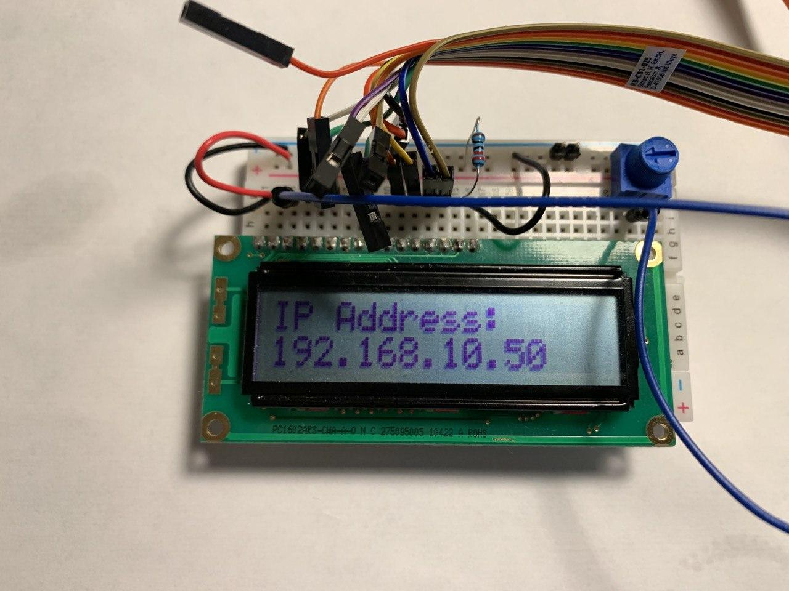

# ipv4_16x2
Small program for displaying IPv4 address on hd44780 LCD display

### Requirements
+ WiringPi
+ make
+ gcc
+ Raspberry Pi (any)
+ cron

### Installation
The program can be easily installed by running the installation script.

    $ chmod -x install.sh
    $ ./install.sh

Installation script automatically adds cronjob for the program!
Program needs sudo at one point. Script installs program into `/opt/bin/ipv4_16x2` folder.

### Build
User can also build software by simply executing the make command.

    $ make
