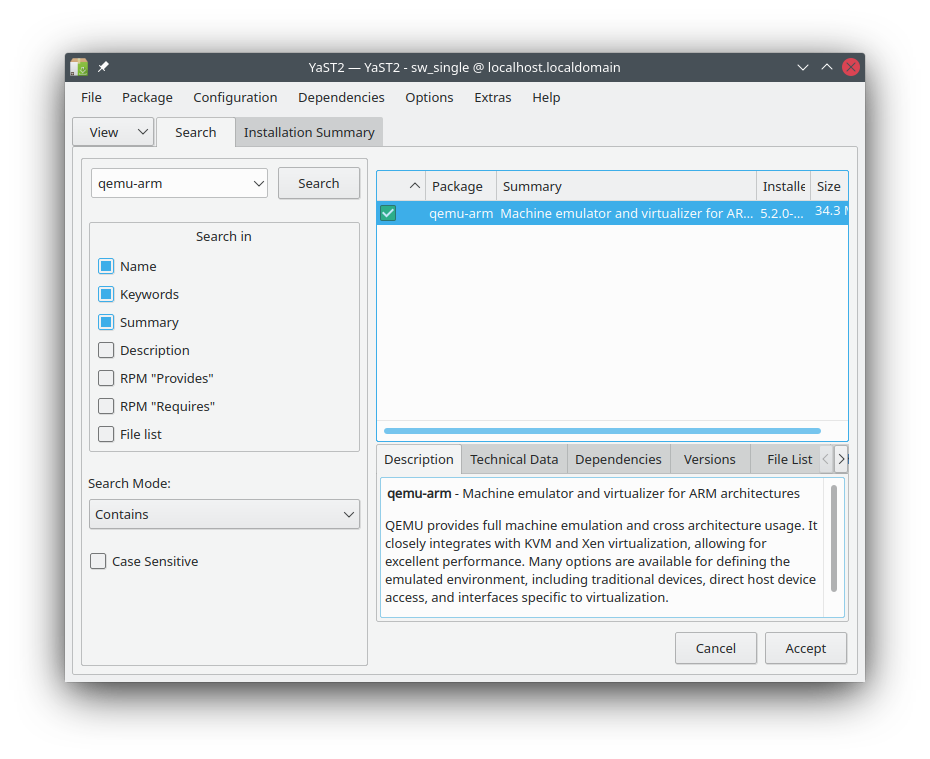
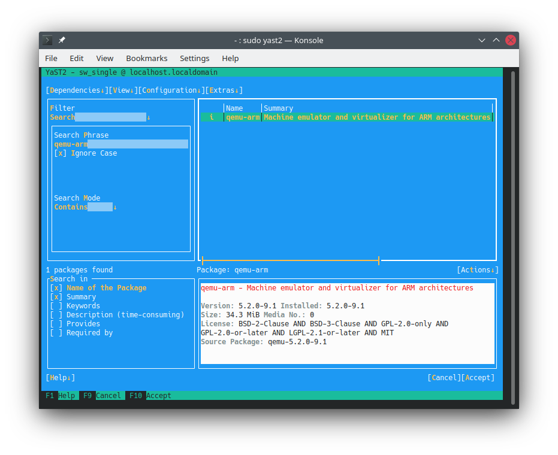
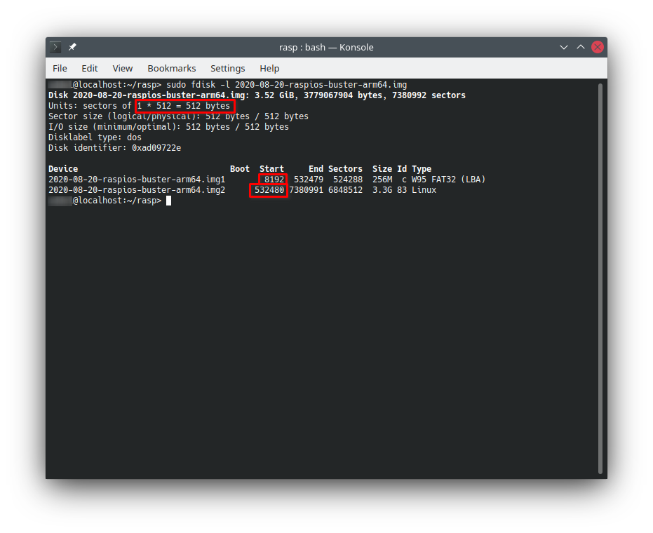
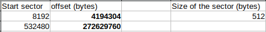
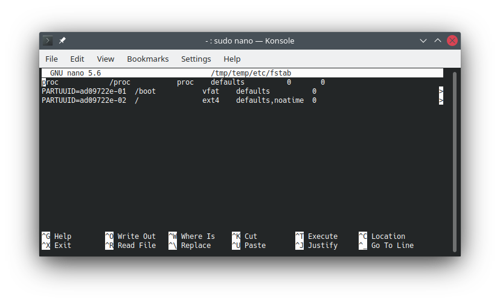
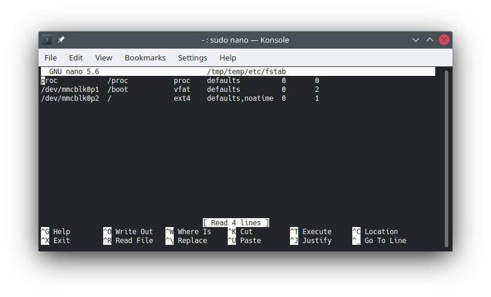
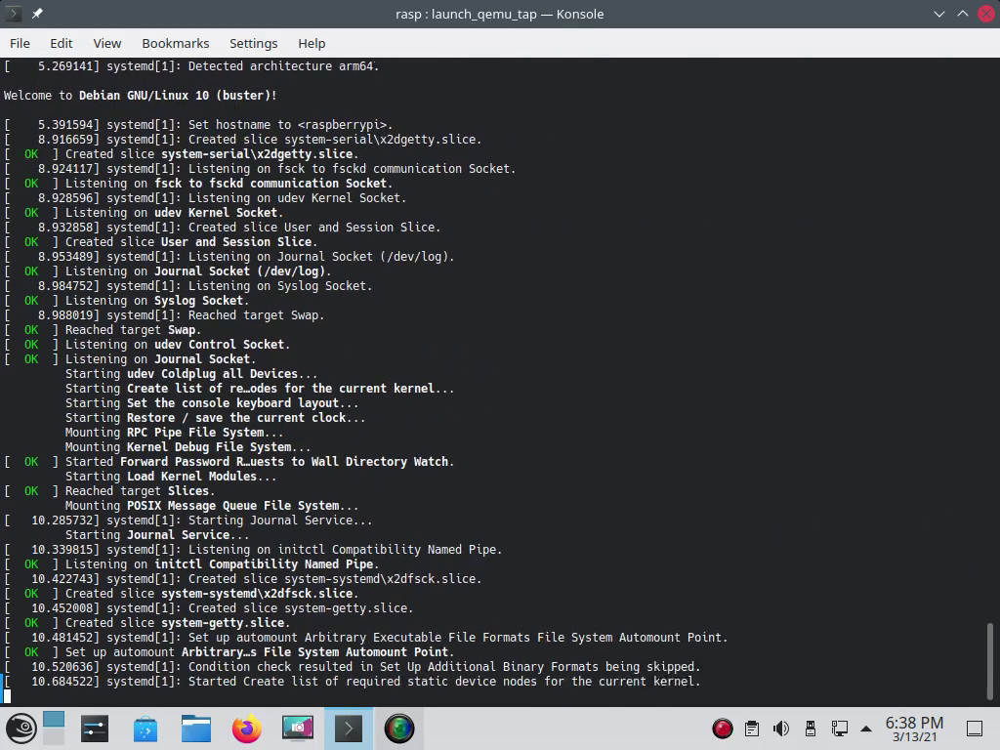
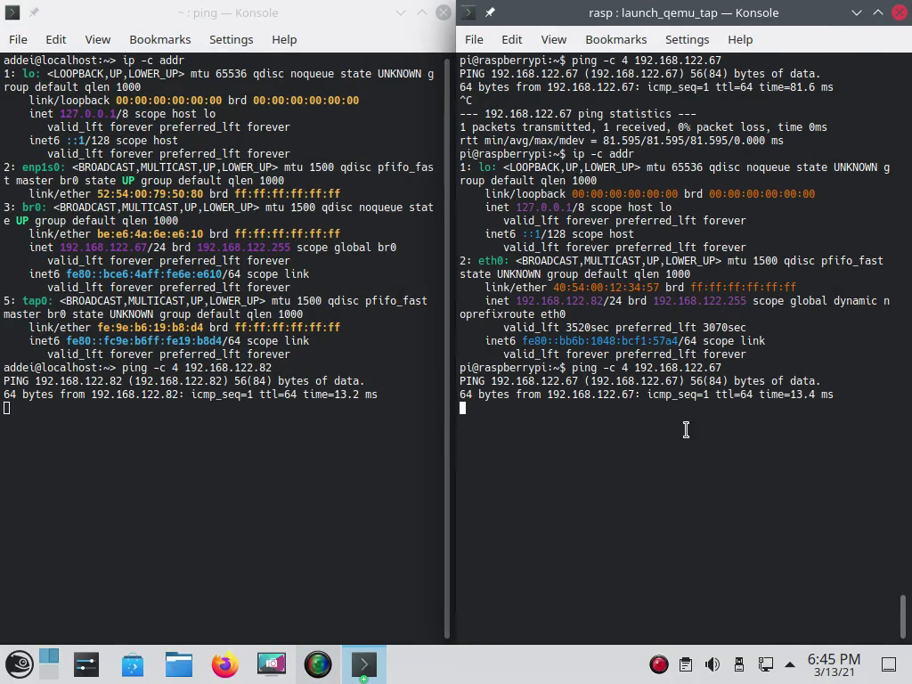
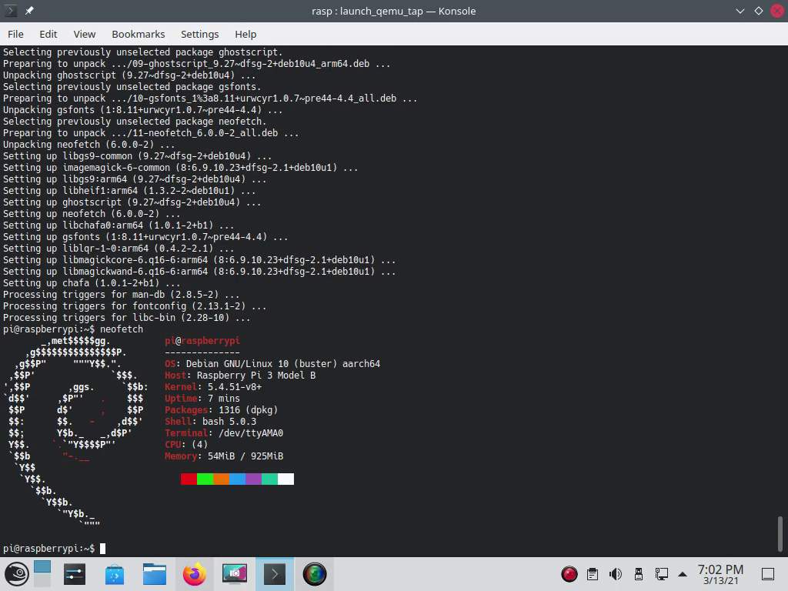
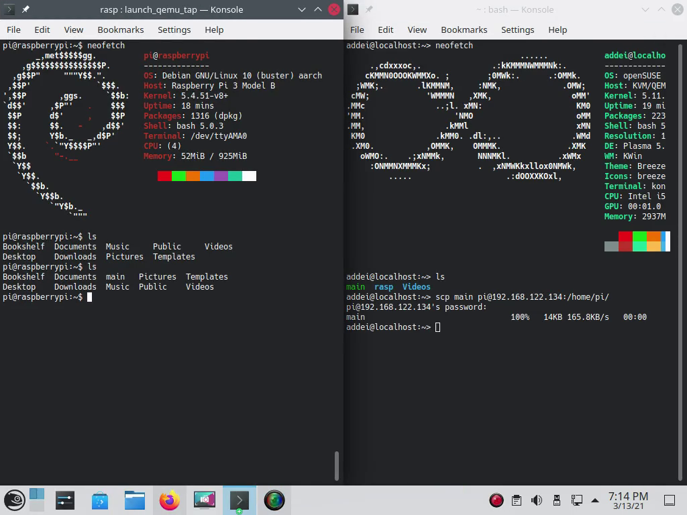

# Guide on how to emulate Raspberry Pi OS (aarch64) on openSUSE Tumbleweed (x86-64) by using QEMU
___

## Summary

Software development for the specific device can be tedious, especially when you don't own the hardware. One convenient solution is to use virtual machine for this job. This means the user must set up a virtual environment, configure the virtual machine and install build tools on it. In this guide I detail the process of installation and configuration of such a virtual device.
___
## Requirements
+ OpenSUSE Tumbleweed
+ Basic knowledge on GNU/Linux operating systems and hardware virtualization
+ Processor capable for emulation
+ enough ram for the guest system
+ enough system disk space for the quest system
___
## Host installation

There are three different ways to install Qemu and required dependencies in openSUSE. These are listed below from easiest to hardest:
 
1. Zypper (CLI)
2. YaST Software Management (CLI + GUI)
3. Build from the source (not recommended)

#### 1. Zypper (CLI)
Easiest way to install latest dependencies for QEMU in OpenSUSE Tumbleweed is using system package manager. In openSUSE this is called Zypper.
    
    // install qemu-arm
    $ zypper in qemu-arm
Zypper downloads all the other required dependencies for the qemu-arm virtualization.

#### 2. YaST Software Management (CLI + GUI)

YaST provides easy to use frontend for installing software on OpenSUSE.

Package needed: `qemu-arm`

YaST Software Management tool downloads all the other required dependencies for the qemu-arm virtualization.

GUI            |  CLI
:-------------------------:|:-------------------------:
  |  

### 3. Build from the source (not recommended)
It is possible to build necessary packages from the source. This is more advanced way to do it, and usually not recommended as it means user needs to maintain packages by themselves.

### Add user to kvm group 
Once all the necessary packages have been installed, it is recommended to add the user to the `kvm` group, because for example, the networking needs elevated permissions. In OpenSUSE Tumbleweed you can use the terminal command `usermod` or YaST User and Group Management (CLI + GUI) for user group management.

    //add user to kvm group
    $ usermod -a -G kvm $USER

After the command has executed, log out of the session and log back in again. This makes group changes effect immediately without of need to reboot the system.
___

## Download latest build of Raspberry Pi OS 64-bit

Official 64-bit images can be found from this ftp-server https://downloads.raspberrypi.org/raspios_arm64/images/

    //create project folder and change directory to it
    # mkdir rasp
    # cd rasp

    //download the image and sha256 hashfile
    # wget https://downloads.raspberrypi.org/raspios_arm64/images/raspios_arm64-2020-08-24/2020-08-20-raspios-buster-arm64.zip
    # wget https://downloads.raspberrypi.org/raspios_arm64/images/raspios_arm64-2020-08-24/2020-08-20-raspios-buster-arm64.zip.sha256

    //verify the image using sha256sum tool
    # sha256sum -c 2020-08-20-raspios-buster-arm64.zip 2020-08-20-raspios-buster-arm64.zip.sha256

If verifying succeeds, uncompress the file and continue configuration.

    //uncompress the file
    # unzip 2020-08-20-raspios-buster-arm64.zip

### Initial image configuration
Before we can start the emulation, two files are needed for the emulator and small change to file systems table is needed. This can be done by mounting partitions using correct offset from the raw image individually. This is possible only if we know the file system type and the correct offset mount on. `fdisk` provides us a tool which shows both needed attributes.

    //read and list disk partition table using fdisk
    $ fdisk -l 2020-08-20-raspios-buster-arm64.img

Offset can be calculated using this formula:

`start sector * size of the sector = offset`

As shown in the picture above, our size of the sector is 512 bytes and first partition starts from the 8192 sector and second partition starts from the 532480 sector. Little math as shown down below gives us correct offsets for the each partition.

Copy files `bcm2710-rpi-3-b.dtb` and `kernel8.img` from the first partition (.img1):

    //make temporary mountpoint
    # mkdir /tmp/temp

    //make folder for the files 
    # mkdir bootpart

    //mount vfat partition
    $ mount -v -o offset=4194304 -t vfat 2020-08-20-raspios-buster-arm64.img /tmp/temp
    
    //copy files from the partition to freshly made folder
    # cp /tmp/temp/kernel8.img bootpart/
    # cp /tmp/temp/bcm2710-rpi-3-b.dtb bootpart/
    
    //unmount the partition
    $ umount /tmp/temp

Edit `/etc/fstab` on the second partition (.img2):

    //mount ext4 the partition
    $ mount -v -o offset=272629760 -t ext4 2020-08-20-raspios-buster-arm64.img /tmp/temp
    
    //make backup of the fstab file
    $ cp /tmp/temp/etc/fstab /tmp/temp/etc/fstab.bak

    //edit the file
    $ nano /tmp/temp/etc/fstab

From the fstab device-spec for the mount-point `/boot` and `/` from `PARTUUID=ad09722e-01` & `PARTUUID=ad09722e-02` to `/dev/mmcblk0p1` & `/dev/mmcblk0p2` as show below.

Original            |  Modified
:-------------------------:|:-------------------------:
  |  

After modification is completed unmount the partition:

    $ umount /tmp/temp

Resize the image for more space to work with on emulated environment:

    // resize the ram image for larger size 
    qemu-img resize 2020-08-20-raspios-buster-arm64.img 4G

Size can be larger than 4 GiB but make sure not to set size smaller than the original image size as then there are potential to lose some data!

## Setting up networking on host device

Networking is usually essential for connectivity between the host and the client systems as project files needs to be accessible. It is also good to be able to update the virtual machine system. 

#### 1. Socket

Setting up socket does not need any configuration on the host device and thus makes it easy to set up. Only major issue is that it limits the client networking to local connections as only specified ports are forwarded to host localhost.

#### 2. Tap on bridge

Connection bridging allows full network functionality on the client system (virtual machine). QEMU creates tap on boot which is then attached to the bridge and used by the virtual machine (client).

Network tap for the client needs some level of configuration on the host system. User needs to create a bridge on network card interface, flush old settings and start dhclient service on the bridge. This ensures connection between the host and the client and provides connections outside equally.

    //setting up a bridge and attach network interface to it
    $ ip link add name bridge_name type bridge
    $ ip addr flush dev name_of_the_working_nic
    $ ip link set name_of_the_working_nic master bridge_name
    $ ip link set bridge_name up
    $ ip link set name_of_the_working_nic up
    $ dhclient -v br0
    $ bridge link

Example:

    //setting up a bridge and attach network interface to it (EXAMPLE)
    $ ip link add name br0 type bridge
    $ ip addr flush dev enp1s0
    $ ip link set enp1s0 master br0
    $ ip link set br0 up
    $ ip link set enp1s0 up
    $ dhclient -v br0
    $ bridge link

More info about QEMU networking: https://wiki.qemu.org/Documentation/Networking

## Virtual machine configuration

#### 1. Virtual machine with restricted network connectivity (socket - port forwarding):

    qemu-system-aarch64 \
        -M raspi3 \
        -append "rw earlyprintk=ttyAMA0,115200 loglevel=8 console=ttyAMA0,115200 root=/dev/mmcblk0p2 rootfstype=ext4 rootwait   rw" \
        -cpu cortex-a53 \
        -dtb bootpart/bcm2710-rpi-3-b.dtb \
        -drive id=sd,file=2020-08-20-raspios-buster-arm64.img,format=raw \
        -kernel bootpart/kernel8.img \
        -m 1024 \
        -serial mon:stdio \
        -no-reboot \
        -device usb-net,netdev=net0 \
	    -netdev user,id=net0,hostfwd=tcp::10022-:22 \
        -nographic

#### 2. Virtual machine with full network connectivity (bridged setup):

    qemu-system-aarch64 \
        -M raspi3 \
        -append "rw earlyprintk=ttyAMA0,115200 loglevel=8 console=ttyAMA0,115200 root=/dev/mmcblk0p2 rootfstype=ext4 rootwait rw" \
        -cpu cortex-a53 \
        -dtb bootpart/bcm2710-rpi-3-b.dtb \
        -drive id=sd,file=2020-08-20-raspios-buster-arm64.img,format=raw \
        -kernel bootpart/kernel8.img \
        -m 1024 \
        -serial mon:stdio \
        -no-reboot \
        -device usb-net,netdev=net0 \
	    -netdev bridge,br=br0,id=net0 \
        -nographic

Tip: creating launch script for the QEMU makes launching the virtual machine far more easier.

User can also allow graphics on the virtual machine by removing the `-nographic` and adding approriate lines for the cursor/display handling.

## First time boot up

After the first boot, the user should run raspi-config and adjust the settings for the device. Here is a list of things user should consider:

1. Boot Options -> set text console as default
2. Interfacing Options -> Enable SSH server
3. Advanced Options -> Expand Filesystem

__*Click on the image to see a video of configuring the Raspberry Pi OS.*__

## Tests

__*Click on the image to see a video of the test.*__ 

#### Ping tests between the client and the host machine.

#### Neofetch installation on the client machine.

#### File transfer + executing 64-bit aarch64 binary blop

#### 

## End notes
